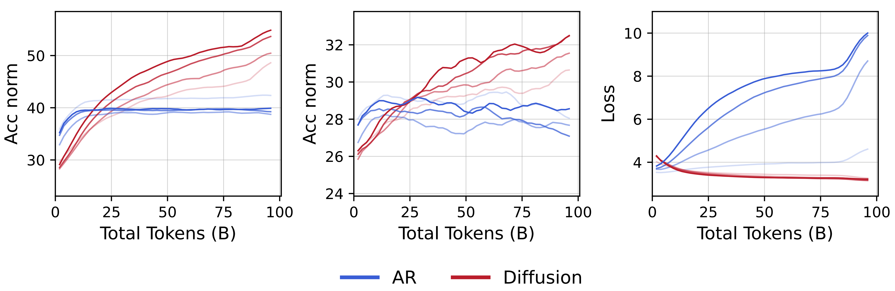

<p align="center" width="100%">

</p>

<div align="center">

**Diffusion Language Models are Super Data Learners**
===========================

<h4>Witness the first crossover where diffusion beats AR.</h4>

[](https://jinjieni.github.io/dlms-are-super-data-learners/resources/pdf/Diffusion_Language_Models_are_Super_Data_Learners.pdf)
[](https://jinjieni.notion.site/Diffusion-Language-Models-are-Super-Data-Learners-239d8f03a866800ab196e49928c019ac)
[](https://x.com/NiJinjie/status/1954177095435014533)
[](https://x.com/NiJinjie/status/1974113126905000242)
</div>


# News
[2025-10-27] We release the codebase and all training checkpoints. The codebase is highly optimized and is industry-level in terms scalability and efficiency.

[2025-10-03] The full paper is out! Check it out [here](resources/pdf/Diffusion_Language_Models_are_Super_Data_Learners.pdf)! We did extensive ablations and scaled-up runs. 


<br>

# Code
The codebase is released [here](https://github.com/JinjieNi/MegaDLMs). It is a highly-optimized codebase for any-scale DLMs training backend with Megatron-LM.

> You can also use the code under the `mega-dlms` folder of this repo, which might not be actively maintained.

<br>

# Resources

We opensource all model checkpoints, training logs, and datasets mentioned in the paper. All of them can be downloaded at https://huggingface.co/collections/jinjieni/mdga.

The easiest way to download a folder is using this script (setup the variables properly):
```
python utils/hf_download_folder.py
```

Alternatively, you can also use `wget` to directly download individual files from the folder, e.g.:
```bash
wget https://huggingface.co/datasets/MDGA-1/super_data_learners_logs/tree/main/xxx/xxx.pt
```

We link the related resources below:

- Diffusion vs. AR with various unique data budgets
    - [[ckpt]()][[log]()] 0.5B unique 192 epochs DLM
    - [[ckpt]()][[log]()] 0.5B unique 192 epochs AR
    - [[ckpt]()][[log]()] 1B unique 96 epochs DLM
    - [[ckpt]()][[log]()] 1B unique 96 epochs AR
    - [[ckpt]()][[log]()] 1.5B unique 64 epochs DLM
    - [[ckpt]()][[log]()] 1.5B unique 64 epochs AR
    - [[ckpt]()][[log]()] 10B unique 9.6 epochs DLM 
    - [[ckpt]()][[log]()] 10B unique 9.6 epochs AR
    - [[ckpt]()][[log]()] 96B unique 1 epochs DLM 
    - [[ckpt]()][[log]()] 96B unique 1 epochs AR
- Diffusion vs. AR with various data qualities
    - [[ckpt]()][[log]()] low DLM
    - [[ckpt]()][[log]()] low AR
    - [[ckpt]()][[log]()] medium DLM
    - [[ckpt]()][[log]()] medium AR
    - [[ckpt]()][[log]()] high DLM
    - [[ckpt]()][[log]()] high AR
- Diffusion vs. AR with various model sizes
    - [[ckpt]()][[log]()] 1B DLM
    - [[ckpt]()][[log]()] 1B AR
    - [[ckpt]()][[log]()] 2B DLM
    - [[ckpt]()][[log]()] 2B AR
    - [[ckpt]()][[log]()] 4B DLM
    - [[ckpt]()][[log]()] 4B AR
    - [[ckpt]()][[log]()] 8B DLM
    - [[ckpt]()][[log]()] 8B AR
- Diffusion vs. AR with various model sparsities
    - [[ckpt]()][[log]()] 1B DLM
    - [[ckpt]()][[log]()] 1B AR
    - [[ckpt]()][[log]()] 8B1A DLM
    - [[ckpt]()][[log]()] 8B1A AR
    - [[ckpt]()][[log]()] 8B DLM
    - [[ckpt]()][[log]()] 8B AR
- Dropout Ablations
    - [[ckpt]()][[log]()] 0.0
    - [[ckpt]()][[log]()] 0.1
    - [[ckpt]()][[log]()] 0.3
    - [[ckpt]()][[log]()] 0.5
    - [[ckpt]()][[log]()] 0.7
    - [[ckpt]()][[log]()] 0.9
- Input Masking
    - [[ckpt]()][[log]()] 0.0
    - [[ckpt]()][[log]()] 0.1
    - [[ckpt]()][[log]()] 0.2
    - [[ckpt]()][[log]()] 0.3
    - [[ckpt]()][[log]()] 0.4
    - [[ckpt]()][[log]()] 0.5
    - [[ckpt]()][[log]()] 0.7
    - [[ckpt]()][[log]()] 0.9
- Coder Scaling
    - [[ckpt (HF)]()][[log]()] 1.7B DLM
    - [[ckpt (HF)]()][[log]()] 1.7B AR
- [[ckpt (HF)]()][[log]()] 1B DLM 480 epochs


<br>

# Citation
```
@misc{ni2025difflm,
title={Diffusion Language Models are Super Data Learners},
author={Ni, Jinjie and the team},
year={2025},
howpublished={\url{https://jinjieni.notion.site/Diffusion-Language-Models-are-Super-Data-Learners-239d8f03a866800ab196e49928c019ac}},
note={Notion Blog},
}
```
